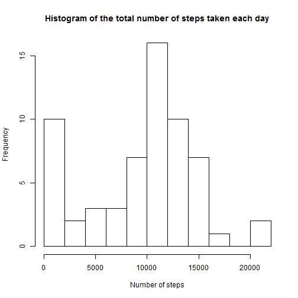
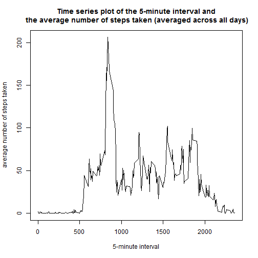
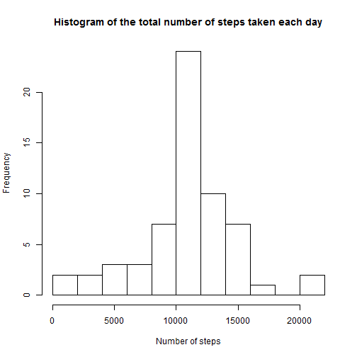
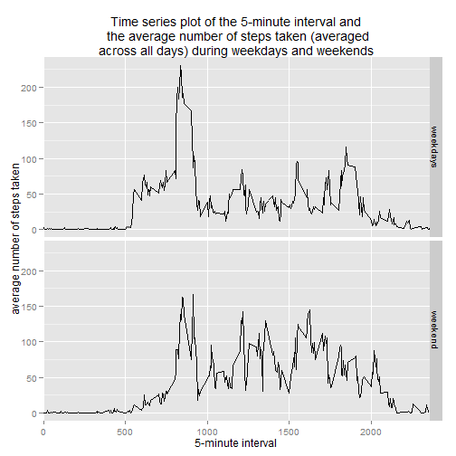

##Loading and preprocessing the data


```r
setwd("C:/Users/Elodie/Documents/Coursera courses/reproducible research/Peer assessement 1/repdata-data-activity")
data<-read.csv("activity.csv", header=T)
```

It is easier to manipulate each column of the dataframe after giving them straightforward and short names so the dollar sign does not have to be used. We also need to let R know that the class of the second column is "date" 


```r
steps <- data$steps
date <- as.Date(data$date)
interval <- data$interval
```

##What is mean total number of steps taken per day?


```r
sum_step <- tapply(steps, date, sum, na.rm = TRUE, simplify = TRUE)
hist(sum_step, xlab = "Number of steps", main = "Histogram of the total number of steps taken each day", breaks=10)
```

 

```r
mean(sum_step)
```

```
## [1] 9354
```

```r
median(sum_step)
```

```
## [1] 10395
```

The mean total number of steps taken per day is 9354, and the median is 10395.

##What is the average daily activity pattern?


```r
interval <- as.factor(interval)
average_step_interval <- tapply(steps, interval, mean, na.rm = TRUE, simplify = TRUE)
plot(levels(interval), average_step_interval, xlab = "5-minute interval", ylab="average number of steps taken",  main = "Time series plot of the 5-minute interval and\n the average number of steps taken (averaged across all days)", type="l")
```

 

```r
names(which.max(average_step_interval))
```

```
## [1] "835"
```

The 5-minute interval which contains the maximum number of steps on average across all the days is 835.

##Imputing missing values


```r
summary(is.na(data))
```

```
##    steps            date          interval      
##  Mode :logical   Mode :logical   Mode :logical  
##  FALSE:15264     FALSE:17568     FALSE:17568    
##  TRUE :2304      NA's :0         NA's :0        
##  NA's :0
```

The total number of missing values in the dataset is 2304.Those missing values are all located in the "steps" variable. 

The strategy selected here for for filling in all of the missing values in the dataset is to use the mean of the 5-minute interval for which the value is missing, with the loop below. 


```r
data_with_na <- data
for (i in 1:length(data$steps)) {
       if (is.na(data$steps[i])) {
             for (j in 1:length(average_step_interval)) {
                   if (as.character(data$interval[i]) == names(average_step_interval[j])) 
                         data$steps[i] = average_step_interval[j]
               }
        }
   }
data_without_na <- data

summary(is.na(data_without_na))
```

```
##    steps            date          interval      
##  Mode :logical   Mode :logical   Mode :logical  
##  FALSE:17568     FALSE:17568     FALSE:17568    
##  NA's :0         NA's :0         NA's :0
```

"data_without_na" is a new dataset that is equal to the original dataset but with the missing data filled in as attested by the summary(is.na(data_without_na)). 


```r
steps_no_na <- data_without_na$steps
date_no_na <- as.Date(data_without_na$date)
interval_no_na <- data_without_na$interval

sum_step_no_na <- tapply(steps_no_na, date_no_na, sum, na.rm = TRUE, simplify = TRUE)
hist(sum_step_no_na, xlab = "Number of steps", main = "Histogram of the total number of steps taken each day", breaks=10)
```

 

```r
mean(sum_step_no_na)
```

```
## [1] 10766
```

```r
median(sum_step_no_na)
```

```
## [1] 10766
```

The mean and median for the new dataset in which NA values have been replaced with the mean of the 5-minute interval are both equal to 10766. They have both increased when the missing values have been replaced (from initial values of 9354 and 10395, for the mean and median, respectively). The transformation also led to data that is more normally distributed as shown by the histograms pre and post transformation. 

##Are there differences in activity patterns between weekdays and weekends?


```r
weekdays <- weekdays(date_no_na)
for (i in 1:length(weekdays)) {
  if ((weekdays[i] == "Saturday") | (weekdays[i] == "Sunday")) 
    weekdays[i] = "weekend" else weekdays[i] = "weekdays"
}
data_without_na$weekdays <- weekdays
head(data_without_na)
```

```
##     steps       date interval weekdays
## 1 1.71698 2012-10-01        0 weekdays
## 2 0.33962 2012-10-01        5 weekdays
## 3 0.13208 2012-10-01       10 weekdays
## 4 0.15094 2012-10-01       15 weekdays
## 5 0.07547 2012-10-01       20 weekdays
## 6 2.09434 2012-10-01       25 weekdays
```


```r
require(ggplot2)
```

```
## Loading required package: ggplot2
```

```r
data_without_na_split<- split(data_without_na, data_without_na$weekdays)
weekdays <- data_without_na_split$weekdays
weekend <- data_without_na_split$weekend
average_step_interval_weekdays <- tapply(weekdays$steps, weekdays$interval, mean, na.rm = TRUE, simplify = TRUE)
average_step_interval_weekend <- tapply(weekend$steps, weekend$interval, mean, na.rm = TRUE, simplify = TRUE)
final_df <- data.frame(stringsAsFactors=FALSE, steps = c(average_step_interval_weekdays, average_step_interval_weekend), interval = c(levels(interval), levels(interval)), weekdays = as.factor(c(rep("weekdays",length(average_step_interval_weekdays)), rep("weekend", length(average_step_interval_weekend)))))

g<-ggplot(final_df)
g+geom_line(aes(y=steps, x=as.numeric(interval),group=weekdays))+facet_grid(weekdays ~ .)+ labs(title = "Time series plot of the 5-minute interval and\n the average number of steps taken (averaged\n across all days) during weekdays and weekends ") + labs(x = "5-minute interval", y = "average number of steps taken")+scale_x_discrete(breaks=c(0,500,1000,1500,2000))
```

 

From the plots generated, it appears that the number of steps taken during week ends is generally higher than during week days, except for the activity in the early morning and for a peak occurring at around 8 am which is higher on week days.

